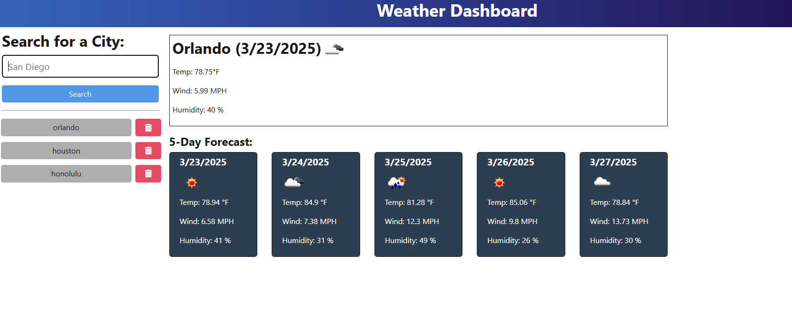

# Professional README Generator

  

  ## Description
The Weather Dashboard is a full-stack application that allows users to search for the current and future weather outlook for cities around the world using the OpenWeather API. Designed with travelers in mind, the dashboard provides a seamless interface to plan trips based on weather conditions.

The backend fetches and processes weather data from the OpenWeather API, while the front end displays the data in an organized, user-friendly interface. The application also stores search history, allowing users to quickly revisit weather information for previously searched cities.

  ## Table of Contents
  - [Installation](#Installation)
  - [Usage](#Usage)
  - [Screenshot](#Screenshot)
  - [Deployment](#Deployment)
  - [Contribution](#Contribution)
  - [Tests](#Tests)
  - [License](#License)
  - [Questions](#Questions)

  ## Installation
To set up and run the application locally:  

    git clone https://github.com/yourusername/weather-dashboard.git

    cd weather-dashboard

    npm install

    create .env file with url and api key

    https://api.openweathermap.org

  ## Usage
To run the application:

    npm run start:dev

    Then, open the front-end interface in your browser. You can enter a city name to retrieve the current weather conditions and a 5-day forecast. The searched city will be saved in the search history, and clicking on it will reload the data for that city.

  ## Screenshot

  ## Deployment
  The full application is deployed via Render. You can view the live app here: https://weather-dashboard-im1y.onrender.com

  ## Contribution
  Contributions are welcome! If you have suggestions or improvements, feel free to fork the repo and submit a pull request.

  ## Tests
  Manual testing can be done by entering city names in the search bar and verifying:

    Current weather data is correct

    5-day forecast renders accurately

    Search history updates and works properly

  ## License
This project is licensed under the BSD license.
 

  ## Questions
  If you have any questions, please contact me at michael.mangieri@yahoo.com.

  You can find more of my work at [github.com/hazyplebian]

